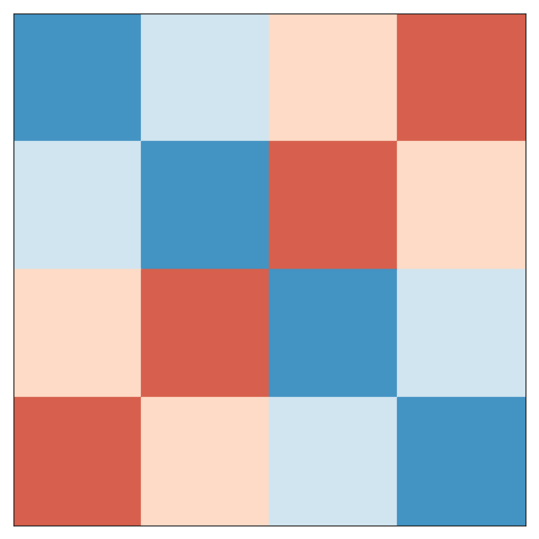

## **`HyperComplex Python Library`**

A Python library for working with quaternions, octonions, sedenions, and beyond following the Cayley-Dickson construction of hypercomplex numbers.

The [complex numbers](https://en.wikipedia.org/wiki/Complex_number) may be viewed as an extension of the everyday [real numbers](https://en.wikipedia.org/wiki/Real_number). A complex number has two real-number coefficients, one multiplied by 1, the other multiplied by [i](https://en.wikipedia.org/wiki/Imaginary_unit).

In a similar way, a [quaternion](https://en.wikipedia.org/wiki/Quaternion), which has 4 components, can be constructed by combining two complex numbers. Likewise, two quaternions can construct an [octonion](https://en.wikipedia.org/wiki/Octonion) (8 components), and two octonions can construct a [sedenion](https://en.wikipedia.org/wiki/Sedenion) (16 components).

The method for this construction is known as the [Cayley-Dickson construction](https://en.wikipedia.org/wiki/Cayley%E2%80%93Dickson_construction) and the resulting classes of numbers are types of [hypercomplex numbers](https://en.wikipedia.org/wiki/Hypercomplex_number). There is no limit to the number of times you can repeat the Cayley-Dickson construction to create new types of hypercomplex numbers, doubling the number of components each time.

This Python 3 package allows the creation of number classes at any repetition level of Cayley-Dickson constructions, and has built-ins for the lower, named levels such as quaternion, octonion, and sedenion.


### **`Special Thanks`**

This package is a combination of the work done by [discretegames](https://github.com/discretegames) providing the [mathdunders](https://github.com/discretegames/mathdunders) and most of the [hypercomplex](https://github.com/discretegames/hypercomplex) base functionality, but also [thoppe](https://github.com/thoppe) for providing the base graphical plot functionality from [cayley-dickson](https://github.com/thoppe/Cayley-Dickson).

This library however has been taylored to use ***`Jupiter Notebook`***, and the native notebook functionality of Visual Studio Code rather than work as command line tools.  I have also added to these base packages, functionality for `inner, outer and hadamard products`.

Another significant update is the `HyperComplex.group()` function which has been updated to better display the rotational transforms up to `Octonions`, `Sedenions` are also included, but as you will see it is very complex and not very useful when displayed in 2D.

### **`Requirements`**

The following packages are required, specifially for the graphical functionality, if you remove the HyperComplex.group() and HyperComplex.plot() methods, you no longer need these requirements and the package can work standalone:

- numpy
- pylab
- itertools
- functools
- matplotlib
- graph_tool
- graph_tool.draw
- seaborn
- networkx
- numbers

### **`Import HyperComplex Library`**

```python
from hypercomplex import *
```

### **`Basic Usage`**

You can any of the following:

- `R`, `Real` for real numbers (1 bit)
- `C`, `Complex` for complex numbers (2 bit)
- `H`, `Q`, `Quaternion` for quaternion numbers (4 bit)
- `O`, `Octonion` for octonion numbers (8 bit)
- `S`, `Sedenion` for sedenion numbers (16 bit)
- `P`, `Pathion` for pathion numbers (32 bit)
- `X`, `Chingon` for chingon numbers (64 bit)
- `U`, `Routon` for routon numbers (128 bit)
- `V`, `Voudon` for voudon numbers (256 bit)

Higher order numbers can be created using the function `cayley_dickson_construction(N)` where N is the previous basis of the one you are trying to create.

```python
AA = H(1,2,3,4)
AB = H(Complex(1,2),C(3,4))
AC = H((1,2),(3,4))
AD = H((1,2,3,4))
AE = H([1,-2,-3,-4])
AF = O()
AG = cayley_dickson_construction(V)()

print(AF + AA)
print(AF + O(0,AA))
print(2 * AA)
print(AA == (1,2,3,4))
print(len(AA))
print(len(AG))
print(AA.square())
print(AA.norm())
print(AA.inverse())
print(1 / AA)
```

```
(1 2 3 4 0 0 0 0)
(0 0 0 0 1 2 3 4)
(2 4 6 8)
True
4
512
30.0
5.477225575051661
(0.0333333 -0.0666667 -0.1 -0.133333)
(0.0333333 -0.0666667 -0.1 -0.133333)
```

### **`HyperComplex Methods`**

```python
print("Real Part:\n",           AA.real, "\n")
print("Imaginary Part:\n",      AA.imag, "\n")
print("Coefficients:\n",        AA.coefficients(), "\n")
print("Conjugate Transpose:\n", AA.conjugate())
```

```
Real Part:
 1.0

Imaginary Part:
 (2.0, 3.0, 4.0)

Coefficients:
 (1.0, 2.0, 3.0, 4.0)

Conjugate Transpose:
 (1 -2 -3 -4)
```

```python
print("String Format:\n",       AA.asstring(translate=True), "\n")
print("String Format:\n",       AE.asstring(translate=True), "\n")
print("Tuple Format:\n",        AA.astuple(), "\n")
print("List Format:\n",         AA.aslist(), "\n")
print("Object Format:\n",       AA.asobject())
```

```
String Format:
 1 + 2.0i + 3.0j + 4.0k

String Format:
 1 - 2.0i - 3.0j - 4.0k

Tuple Format:
 (1.0, 2.0, 3.0, 4.0)

List Format:
 [1.0, 2.0, 3.0, 4.0]

Object Format:
 (1 2 3 4)
```

```python
print("Inner Product:\n",       AA.innerproduct(AB), "\n")
print("Outer Product:\n",       AA.outerproduct(AB, asstring=True, translate=True), "\n")
print("Hadamard Product:\n",    AA.hadamardproduct(AB, asobject=True))
```

```
Inner Product:
 30.0

Outer Product:
    1  -2.0i  -3.0j  -4.0k
 2.0i    4.0  -6.0k   8.0j
 3.0j   6.0k    9.0 -12.0i
 4.0k  -8.0j  12.0i   16.0

Hadamard Product:
 (1 4 9 16)
 ```

### **`HyperComplex Multiplication Matricies`**

These can have various options to alter how the data is handed back, `asstring=True` will output the array as a string, adding by default `e0, e1, ...` as the index names, however you can add `translate=True` to change them to `1 + i + j + k, ...` format.  You can also use custom indexes by either changing the `element=e` option or `translations=1ijkmIJKnpqrMPQR` option.

If you select `asobject=True` then the function will output list of HyperComplex objects, and `asnumber=True` will return a list array.  There is also `asgroups=True` and `asplots=True`, however they are mainly used to facilitate the graphical features of the library.

```python
print("String Matrix:\n",       AA.matrix(asstring=True, translate=True), "\n")
print("Object Matrix:\n",       AA.matrix(asobject=True), "\n")
print("Plot ID:\n",             AA.matrix(asplots=True, asstring=True))
```

```
String Matrix:
 1  i  j  k
 i -1  k -j
 j -k -1  i
 k  j -i -1

Object Matrix:
 [(1 1 1 1), (-1 1 -1 1), (-1 1 1 -1), (-1 -1 1 1)]

Plot ID:
 1  2  3  4
 2 -1  4 -3
 3 -4 -1  2
 4  3 -2 -1
```

### **`HyperComplex Graphical Methods`**

For the `HyperComplex.plot()` method, which produces images so we can visualize the multiplication tables with a diverging colormap. Red values are positive, blue values are negative. For example, with the complex numbers 1 => least red, i => most red, -1 => least blue, -i => most blue. Additionally, for the smaller algebras, we can construct the [Cayley Graph](http://en.wikipedia.org/wiki/Cayley_graph) using `HyperComplex.graph()` as shown below for quaternions.  Both methods gain the order from the parent class calling it.

### **`Complex Numbers`**

A [complex number](http://en.wikipedia.org/wiki/Complex_number) is a number that can be expressed in the form `a + bi`, where `a` and `b` are real numbers and `i` is the imaginary unit, imaginary being the root of a negative square number `i = sqrt(-1)`. They are a normed division algebra over the real numbers. There is no natural linear ordering (commutativity) on the set of complex numbers.

The significance of the imaginary unit:

- i * i = -1

- `red` lines show multiplication of complex index `i`.

```python
# NOTE: Takes less than 1s

X = Complex()

X.group(asstring=True, translate=True)
X.plot(diverging=False)
X.plot(diverging=True)
```


### **`Quaternion Numbers`**

[Quaternions](http://en.wikipedia.org/wiki/Quaternion) are a normed division algebra over the real numbers that can be expressed in the form `a + bi + cj + dk`, where `a`, `b`, `c` and `d` are real numbers and `i`, `j`, `k` are the imaginary units.  They are noncommutative. The unit quaternions can be thought of as a choice of a group structure on the 3-sphere S3 that gives the group Spin(3), which is isomorphic to SU(2) and also to the universal cover of SO(3).

The significance of the higher order imaginary units:

- i = j * k
- j = k * i
- k = i * j
- i * i = j * j = k * k = -1
- i * j * k = -1

- `red` lines show multiplication of complex index `i`.
- `blue` lines show multiplication of complex index `j`.

```python
# NOTE: Takes less than 1s

X = Quaternion()

X.group(asstring=True, translate=True)
X.plot(diverging=False)
X.plot(diverging=True)
```





### **`Octonion Numbers`**

[Octonions](http://en.wikipedia.org/wiki/Octonion) are a normed division algebra over the real numbers. They are noncommutative and nonassociative, but satisfy a weaker form of associativity, namely they are alternative. The Cayley graph is hard project into two-dimensions, there overlapping edges along the diagonals. That can be expressed in the form `a + bi + cj + dk + em + fI + gJ + hK`, where `a .. h` are real numbers and `i, j, k, m, I, J, K` are the imaginary units.

The significance of the higher order imaginary units:

- [m, I, J, K] = [1, i, j, k] * m
- I * I = J * J = K * K = m * m = -1
- I * J * K = m

- `red` lines show multiplication of complex index `i`.
- `blue` lines show multiplication of complex index `j`.
- `green` lines show multiplication of complex index `k`.
- `purple` lines show multiplication of complex index `m`.

```python
# NOTE: Takes about 2s

X = Octonion()

X.group(asstring=True, translate=True)
X.plot(diverging=False)
X.plot(diverging=True)
```


### **`Sedenion Numbers`**

[Sedenion](http://en.wikipedia.org/wiki/Sedenion) orm a 16-dimensional noncommutative and nonassociative algebra over the reals obtained by applying the Cayley–Dickson construction to the octonions. That can be expressed in the form `a + i + j + k + m + I + J + K...`, where `a...` are real numbers and `i, j, k, m, I, J, K, n, p, q, r, M, P, Q, R` are the imaginary units.

The significance of the higher order imaginary units:

- [n, p, q, r] = [1, i, j, k] * n
- [M, P, Q, R] = [m, I, J, K] * n
- n * n = p * p = q * q = r * r = -1
- M * M = P * P = Q * Q = R * R = -1
- p * q * r = n
- P * Q * R = M

```python
# NOTE: Takes about 3s

X = Sedenion()

X.group(asstring=True, translate=True)
X.plot(diverging=False)
X.plot(diverging=True)
```


### **`Pathion Numbers`**

Pathions form a 32-dimensional algebra over the reals obtained by applying the Cayley–Dickson construction to the sedenions.

HyperComplex.group() is disabled, as it is far too busy/messy.

```python
# NOTE: Takes about 8s

X = Pathion()

X.plot(diverging=False)
X.plot(diverging=True)
```


### **`Chingon Numbers`**

Chingons form a 64-dimensional algebra over the reals obtained by applying the Cayley–Dickson construction to the pathion.

HyperComplex.group() is disabled, as it is far too busy/messy.

```python
# NOTE: Takes about 50s

X = Chingon()

X.plot(diverging=False)
X.plot(diverging=True)
```


### **`Routon Numbers`**

Routons form a 128-dimensional algebra over the reals obtained by applying the Cayley–Dickson construction to the chingons.

HyperComplex.group() is disabled, as it is far too busy/messy.

```python
# NOTE: Takes about 6m30s

X = Routon()

X.plot(diverging=False)
X.plot(diverging=True)
```


### **`Voudon Numbers`**

Voudons form a 256-dimensional algebra over the reals obtained by applying the Cayley–Dickson construction to the routons.

HyperComplex.group() is disabled, as it is far too busy/messy.

```python
# NOTE: Takes very long time

X = Voudon()

# X.group(translate=True)
# X.plot(diverging=True)
```


