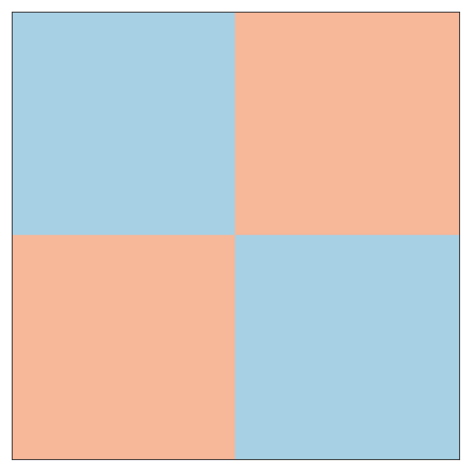
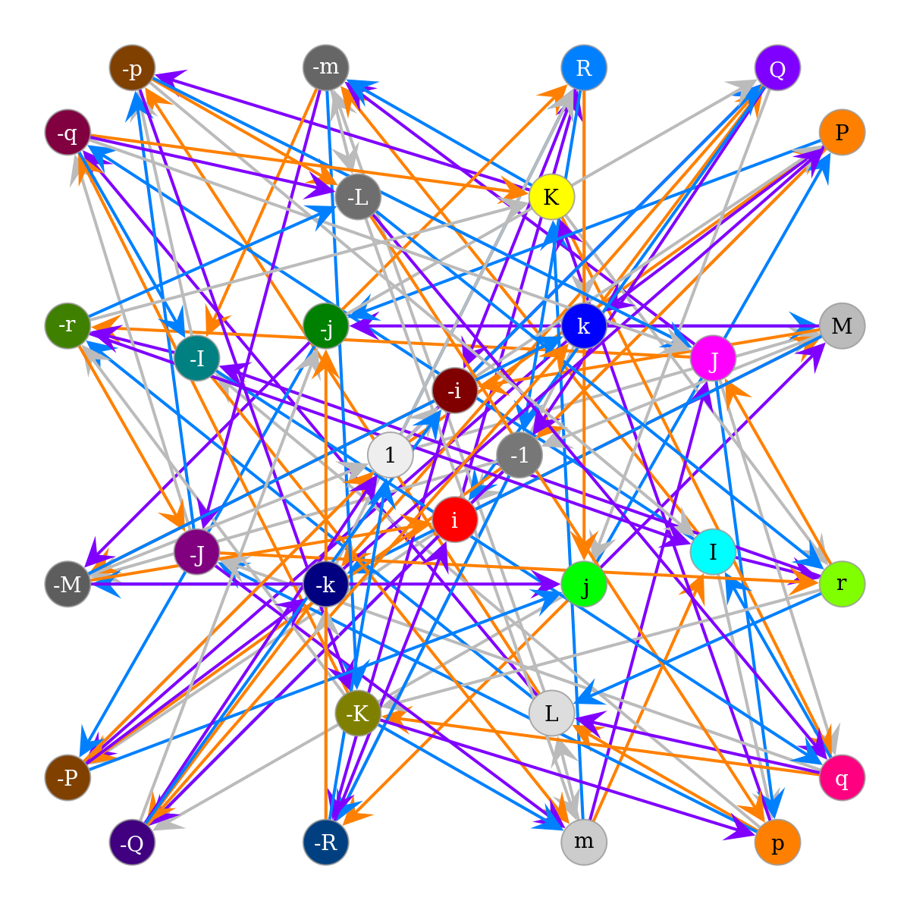

## **`HyperComplex Python Library`**

A Python library for working with quaternions, octonions, sedenions, and beyond following the Cayley-Dickson construction of hypercomplex numbers.

The [complex numbers](https://en.wikipedia.org/wiki/Complex_number) may be viewed as an extension of the everyday [real numbers](https://en.wikipedia.org/wiki/Real_number). A complex number has two real-number coefficients, one multiplied by 1, the other multiplied by [i](https://en.wikipedia.org/wiki/Imaginary_unit).

In a similar way, a [quaternion](https://en.wikipedia.org/wiki/Quaternion), which has 4 components, can be constructed by combining two complex numbers. Likewise, two quaternions can construct an [octonion](https://en.wikipedia.org/wiki/Octonion) (8 components), and two octonions can construct a [sedenion](https://en.wikipedia.org/wiki/Sedenion) (16 components).

The method for this construction is known as the [Cayley-Dickson construction](https://en.wikipedia.org/wiki/Cayley%E2%80%93Dickson_construction) and the resulting classes of numbers are types of [hypercomplex numbers](https://en.wikipedia.org/wiki/Hypercomplex_number). There is no limit to the number of times you can repeat the Cayley-Dickson construction to create new types of hypercomplex numbers, doubling the number of components each time.

This Python 3 package allows the creation of number classes at any repetition level of Cayley-Dickson constructions, and has built-ins for the lower, named levels such as quaternion, octonion, and sedenion.


### **`Special Thanks`**

This package is a combination of the work done by [discretegames](https://github.com/discretegames) providing the [mathdunders](https://github.com/discretegames/mathdunders) and most of the [hypercomplex](https://github.com/discretegames/hypercomplex) base functionality, but also [thoppe](https://github.com/thoppe) for providing the base graphical plot functionality from [cayley-dickson](https://github.com/thoppe/Cayley-Dickson).

### **`Additions To Above Libraries`**

This library has been taylored to use ***`Jupiter / Visual Studio Code Notebooks`*** as well as work with command line for the graphical portions.  I have also added to these base packages, functionality for `inner, outer and hadamard products` as well as extending the graphical capabilities of the Cayley-Dickson graphs to include layers, so as to improve readability when graphing high order complex numbers, sucj as Octonions or Sedenions.  This allows the user to visualise each individual rotation group easilly if so wished, or limit the graph to a specific number of layers, and specific direction of rotation as clockwise `-` and anti-clockwise `+` rotations are handled as seperate layers.

### **`Requirements`**

The following packages are required, specifially for the graphical functionality, if you remove the HyperComplex.group() and HyperComplex.plot() methods, you no longer need these requirements and the package can work standalone:

- itertools
- functools
- argparse
- matplotlib
- graph_tool
- graph_tool.draw
- seaborn
- networkx
- numbers
- numpy
- pylab

### **`Import HyperComplex Library`**

```python
from hypercomplex import *
```

### **`Basic Usage`**

You can any of the following:

- `R`, `Real` for real numbers (1 bit)
- `C`, `Complex` for complex numbers (2 bit)
- `H`, `Q`, `Quaternion` for quaternion numbers (4 bit)
- `O`, `Octonion` for octonion numbers (8 bit)
- `S`, `Sedenion` for sedenion numbers (16 bit)
- `P`, `Pathion` for pathion numbers (32 bit)
- `X`, `Chingon` for chingon numbers (64 bit)
- `U`, `Routon` for routon numbers (128 bit)
- `V`, `Voudon` for voudon numbers (256 bit)

Higher order numbers can be created using the function `cayley_dickson_construction(N)` where N is the previous basis of the one you are trying to create.

```python
AA = H(1,2,3,4)
AB = H(Complex(1,2),C(3,4))
AC = H((1,2),(3,4))
AD = H((1,2,3,4))
AE = H([1,-2,-3,-4])
AF = O()
AG = cayley_dickson_construction(V)()

print("Addition:\n", 			AF + AA, "\n", AF + O(0,AA), "\n")
print("Multiplication:\n", 		2 * AA, "\n")
print("Comparison:\n",			AA == (1,2,3,4), "\n")
print("Lengths:\n",				len(AA), "\n", len(AG), "\n")
print("Square:\n",				AA.square(), "\n")
print("Norm:\n",				AA.norm(), "\n")
print("Inverse:\n",				AA.inverse(), "\n", 1 / AA, "\n")
print("Cacheing:\n",			H.__mul__.cache_info())
```

```
Addition:
 (1 2 3 4 0 0 0 0)
 (0 0 0 0 1 2 3 4)

Multiplication:
 (2 4 6 8)

Comparison:
 True

Lengths:
 4
 512

Square:
 30.0

Norm:
 5.477225575051661

Inverse:
 (0.0333333 -0.0666667 -0.1 -0.133333)
 (0.0333333 -0.0666667 -0.1 -0.133333)

Cacheing:
 CacheInfo(hits=103435, misses=100, maxsize=128, currsize=100)
```

### **`HyperComplex Methods`**

```python
print("Real Part:\n",           AA.real, "\n")
print("Imaginary Part:\n",      AA.imag, "\n")
print("Coefficients:\n",        AA.coefficients(), "\n")
print("Conjugate Transpose:\n", AA.conjugate())
```

```
Real Part:
 1.0

Imaginary Part:
 (2.0, 3.0, 4.0)

Coefficients:
 (1.0, 2.0, 3.0, 4.0)

Conjugate Transpose:
 (1 -2 -3 -4)
```

```python
print("String Format:\n",       AA.asstring(translate=True), "\n")
print("String Format:\n",       AE.asstring(translate=True), "\n")
print("Tuple Format:\n",        AA.astuple(), "\n")
print("List Format:\n",         AA.aslist(), "\n")
print("Object Format:\n",       AA.asobject())
```

```
String Format:
 1 + 2.0i + 3.0j + 4.0k

String Format:
 1 - 2.0i - 3.0j - 4.0k

Tuple Format:
 (1.0, 2.0, 3.0, 4.0)

List Format:
 [1.0, 2.0, 3.0, 4.0]

Object Format:
 (1 2 3 4)
```

```python
print("Inner Product:\n",       AA.innerproduct(AB), "\n")
print("Outer Product:\n",       AA.outerproduct(AB, asstring=True, translate=True), "\n")
print("Hadamard Product:\n",    AA.hadamardproduct(AB, asobject=True))
```

```
Inner Product:
 30.0

Outer Product:
    1  -2.0i  -3.0j  -4.0k
 2.0i    4.0  -6.0k   8.0j
 3.0j   6.0k    9.0 -12.0i
 4.0k  -8.0j  12.0i   16.0

Hadamard Product:
 (1 4 9 16)
 ```

### **`HyperComplex Multiplication Matricies`**

These can have various options to alter how the data is handed back, `asstring=True` will output the array as a string, adding by default `e0, e1, ...` as the index names, however you can add `translate=True` to change them to `1 + i + j + k, ...` format.  You can also use custom indexes by either changing the `element=e` option or `indices=1ijkmIJKnpqrMPQR` option.

If you select `asobject=True (default)` then the function will output list of HyperComplex objects, `astuple=True` and `aslist=True` will return a tuple or list array accordingly.  There is also `asindex=True`, which returns the sign and index id for each cell.

```python
print("String Matrix:\n",		AA.matrix(asstring=True, translate=True), "\n")
print("String Matrix:\n",		AA.matrix(asstring=True, translate=True, indices="1abcd"), "\n")
print("Object Matrix:\n",		AA.matrix(asobject=True), "\n")
print("Index ID:\n",       		AA.matrix(asindex=True, asstring=True))
```

```
String Matrix:
 1  i  j  k
 i -1  k -j
 j -k -1  i
 k  j -i -1

String Matrix:
 1  a  b  c
 a -1  c -b
 b -c -1  a
 c  b -a -1

Object Matrix:
[[(1 0 0 0), ( 0 1 0 0), (0 0 1 0), (0 0 0 1)],
 [(0 1 0 0), (-1 0 0 0), (0 0 0 1), (0 0 -1 0)],
 [(0 0 1 0), ( 0 0 0 -1), (-1 0 0 0), (0 1 0 0)],
 [(0 0 0 1), ( 0 0 1 0), (0 -1 0 0), (-1 0 0 0)]]

Index ID:
 1  2  3  4
 2 -1  4 -3
 3 -4 -1  2
 4  3 -2 -1
```

### **`HyperComplex Graphical Methods`**

For the `HyperComplex.plot()` method, which produces images so we can visualize the multiplication tables with a diverging colormap. Red values are positive, blue values are negative. For example, with the complex numbers 1 => least red, i => most red, -1 => least blue, -i => most blue. Additionally, for the smaller algebras, we can construct the [Cayley Graph](http://en.wikipedia.org/wiki/Cayley_graph) using `HyperComplex.graph()` as shown below for quaternions.  Both methods gain the order from the parent class calling it.

### **`Complex Numbers`**

A [complex number](http://en.wikipedia.org/wiki/Complex_number) is a number that can be expressed in the form `a + bi`, where `a` and `b` are real numbers and `i` is the imaginary unit, imaginary being the root of a negative square number `i = sqrt(-1)`. They are a normed division algebra over the real numbers. There is no natural linear ordering (commutativity) on the set of complex numbers.

The significance of the imaginary unit:

- i * i = -1

In this instance we have selected to show all rotations, both positive and negative, so `red` lines show rotations about `+i`, and `blue` about `-i`.  All Cayley-Dickeson graphs will ignore the rotations about `+1` and `-1` and normally would just show the positive imaginary rotations for brevity.

```python
# NOTE: Takes less than 2s

X = Complex()

X.group(translate=True, show=True, save=True, filename="images/complex_g_all.png", showall=True)
X.group(translate=True, show=True, save=True, filename="images/complex_g_pos.png", positives=True)
X.group(translate=True, show=True, save=True, filename="images/complex_g_neg.png", negatives=True)
X.plot(diverging=False, show=True, save=True, filename="images/complex.png")
X.plot(diverging=True, show=True, save=True, filename="images/complex_d.png")
```





### **`Quaternion Numbers`**

[Quaternions](http://en.wikipedia.org/wiki/Quaternion) are a normed division algebra over the real numbers that can be expressed in the form `a + bi + cj + dk`, where `a`, `b`, `c` and `d` are real numbers and `i`, `j`, `k` are the imaginary units.  They are noncommutative. The unit quaternions can be thought of as a choice of a group structure on the 3-sphere S3 that gives the group Spin(3), which is isomorphic to SU(2) and also to the universal cover of SO(3).

The significance of the higher order imaginary units:

- i = j * k
- j = k * i
- k = i * j
- i * i = j * j = k * k = -1
- i * j * k = -1

Here we can see the benefits to splitting out positives and negatives, with `red, blue, green` showing rotations about `+i, +j, +k` respectively and `purple, orange, yellow` showing the negatives.  Even with only three rotations, this graph is starting to look too busy to see clearly, however as we see with only the positive or negative rotations displayed (and only the first three colours required) the three circle groups representing SO(3) can be clearly visible.

```python
# NOTE: Takes less than 2s

X = Quaternion()

X.group(translate=True, show=True, save=True, filename="images/quaternion_g_all.png", showall=True)
X.group(translate=True, show=True, save=True, filename="images/quaternion_g_pos.png", positives=True)
X.group(translate=True, show=True, save=True, filename="images/quaternion_g_neg.png", negatives=True)
X.plot(diverging=False, show=True, save=True, filename="images/quaternion.png")
X.plot(diverging=True, show=True, save=True, filename="images/quaternion_d.png")
```


### **`Octonion Numbers`**

[Octonions](http://en.wikipedia.org/wiki/Octonion) are a normed division algebra over the real numbers. They are noncommutative and nonassociative, but satisfy a weaker form of associativity, namely they are alternative. The Cayley graph is hard project into two-dimensions, there overlapping edges along the diagonals. That can be expressed in the form `a + bi + cj + dk + em + fI + gJ + hK`, where `a .. h` are real numbers and `i, j, k, m, I, J, K` are the imaginary units.

The significance of the higher order imaginary units:

- [m, I, J, K] = [1, i, j, k] * m
- I * I = J * J = K * K = m * m = -1
- I * J * K = m

Indices rotations are shown in order, `red` first, `blue` second, `green` third and `purple` forth. Also the inner diamond will always show the first rotational group, in this case `m`, with each subsequent rotational group getting further from the centre.  You can enable the arrows by setting `directed=True`, and you can refernce the layers by name (if using `translate=True`) or by id.

For higher order Cayley-Dickson graphs beyonb quaternions, we now need to the layers functionality of the group function, in this case we have chose to display rotations about `m, i, j, k` in the first graph, and `m, I, J, K` in the second.  Colours will always show in order, of `red, blue, green, purple, orange, yeloow, ...` for the graphs in order.  So in our case here `red, blue, green, purple` represent `+m, +i, +j, +k` or `+m, +I, +J, +K` in order.  Her we are just showing positive translations only.

When using layers, the `positives=True`, `negatives=True` or `showall=True` have no effect as they are assumed by the choice of layers given.

```python
# NOTE: Takes about 3s

X = Octonion()

X.group(translate=True, show=True, layers="m,i,j,k", save=True, filename="images/octonion_g_mijk_pos.png")
X.group(translate=True, show=True, layers="-m,-i,-j,-k", save=True, filename="images/octonion_g_mijk_neg.png")
X.group(translate=True, show=True, layers="m,I,J,K", save=True, filename="images/octonion_g_mIJK_pos.png")
X.group(translate=True, show=True, layers="-m,-I,-J,-K", save=True, filename="images/octonion_g_mIJK_neg.png")
X.plot(diverging=False, show=True, save=True, filename="images/octonion.png")
X.plot(diverging=True, show=True, save=True, filename="images/octonion_d.png")
```


### **`Sedenion Numbers`**

[Sedenion](http://en.wikipedia.org/wiki/Sedenion) orm a 16-dimensional noncommutative and nonassociative algebra over the reals obtained by applying the Cayley–Dickson construction to the octonions. That can be expressed in the form `a + i + j + k + m + I + J + K...`, where `a...` are real numbers and `i, j, k, m, I, J, K, n, p, q, r, M, P, Q, R` are the imaginary units.

The significance of the higher order imaginary units:

- [n, p, q, r] = [1, i, j, k] * n
- [M, P, Q, R] = [m, I, J, K] * n
- n * n = p * p = q * q = r * r = -1
- M * M = P * P = Q * Q = R * R = -1
- p * q * r = n
- P * Q * R = M

Now things are getting very complicated (pun intended), we will only show the positive layers, for each of the four main rotational groups, `m,i,j,k`, `m,I,J,K` as for Octonions and their duals `n,p,q,r` and `M,P,Q,R`.  Even as they are, it is still hard to visualise, but displaying fewer layers per image will rectify that, you need to display a minimum of one layer - so you could just display singular rotational groups for maximum readability.

```python
# NOTE: Takes less than 8s

X = Sedenion()

X.group(translate=True, show=True, layers="m,i,j,k", save=True, filename="images/sedenion_g_mijk_pos.png")
X.group(translate=True, show=True, layers="m,I,J,K", save=True, filename="images/sedenion_g_mIJK_pos.png")
X.group(translate=True, show=True, layers="n,p,q,r", save=True, filename="images/sedenion_g_npqr_pos.png")
X.group(translate=True, show=True, layers="M,P,Q,R", save=True, filename="images/sedenion_g_MPQR_pos.png")
X.plot(diverging=False, show=True, save=True, filename="images/sedenion.png")
X.plot(diverging=True, show=True, save=True, filename="images/sedenion_d.png")
```





### **`Pathion Numbers`**

Pathions form a 32-dimensional algebra over the reals obtained by applying the Cayley–Dickson construction to the sedenions.

HyperComplex.group() is disabled, as it is far too busy/messy.

```python
# NOTE: Takes about 9s

X = Pathion()

X.plot(diverging=False, show=True, save=True, filename="images/pathion.png")
X.plot(diverging=True, show=True, save=True, filename="images/pathion_d.png")
```


### **`Chingon Numbers`**

Chingons form a 64-dimensional algebra over the reals obtained by applying the Cayley–Dickson construction to the pathion.

HyperComplex.group() is disabled, as it is far too busy/messy.

```python
# NOTE: Takes about 1m

X = Chingon()

X.plot(diverging=False, show=True, save=True, filename="images/chingon.png")
X.plot(diverging=True, show=True, save=True, filename="images/chingon_d.png")
```


### **`Routon Numbers`**

Routons form a 128-dimensional algebra over the reals obtained by applying the Cayley–Dickson construction to the chingons.

HyperComplex.group() is disabled, as it is far too busy/messy.

```python
# NOTE: Takes about 10m40s

X = Routon()

X.plot(diverging=False, show=True, save=True, filename="images/routon.png")
X.plot(diverging=True, show=True, save=True, filename="images/routon_d.png")
```


### **`Voudon Numbers`**

Voudons form a 256-dimensional algebra over the reals obtained by applying the Cayley–Dickson construction to the routons.

HyperComplex.group() is disabled, as it is far too busy/messy.

```python
# NOTE: Takes very long time

X = Voudon()

X.plot(diverging=False, show=True, save=True, filename="images/voudon.png")
X.plot(diverging=True, show=True, save=True, filename="images/voudon_d.png")
```


